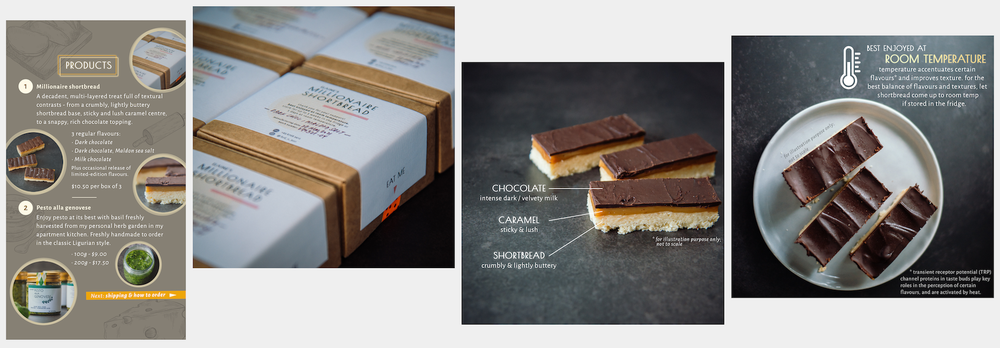

# Portfolio
---
Hello 👋 !  I'm Elaine and I'm a Data Scientist at a food-tech start-up. This is a summary of the various projects I have worked on, barring the more confidential work projects. More specific technical details are in their respective githubs (links included). If you're interested to know more, feel free to [get in touch](mailto:elainezw92@gmail.com), or check out my [resume](./resume_20211129.pdf)/[LinkedIn](https://www.linkedin.com/in/elainezw/). (Straits Times also did a [feature of my career switch](./20201213_ST feature.png).)

#### Contents
1. [Data Science](https://github.com/zzeniale/portfolio#data-science)
2. [Workflow Optimisation Tools](https://github.com/zzeniale/portfolio#workflow-optimisation-tools)
3. [Side Projects](https://github.com/zzeniale/portfolio#side-projects)

---
## Data Science

### Current 
My current projects at Hoow Foods involve modelling various processes involved in food reformulation, with the goal being to produce healthier alternatives without compromising on taste. 

- Data collection: `Selenium`, `Tesseract`
- Data cleaning: `Pandas`, `NumPy`
- Optimisation: `PuLP`
- Machine learning: `Scikit-learn`, `imblearn`, `PyTorch`
- NLP: sentence vectors, named-entity recognition
- Network analysis: community detection, bipartite networks, Louvain algorithm, Leiden algorithm, `NetworkX`, Gephi, Neo4j
- Model deployment: `Flask`, `Kivy`, `Dash`

### General Assembly Course projects
#### 1. Ames Housing Price Prediction
*Oct 2019 | [https://github.com/zzeniale/Ames-housing-price-prediction](https://github.com/zzeniale/Ames-housing-price-prediction)*

  

I examined a comprehensive housing dataset from the city of Ames in Iowa, USA ([source](https://www.kaggle.com/c/dsi-us-6-project-2-regression-challenge/overview)). Homeowners looking to increase the value of their homes often spend too much on remodeling and don't get much ROI when selling the house. On the other hand, people looking to buy houses want to get the best house possible given a budget. The goal of this project is to address some of these concerns, such as which features add the most value to a home, and what kind of house one would be able to afford with a certain budget. 

I tested four different regression models using a variety of feature engineering techniques. An elastic net regression model had the best predictive performance on housing sale price in Ames USA. The model revealed that square feet area, condition, age, and the location of the house are the most important determinants for how much a house sells for. With an R2 of 0.903, it can be used to predict house prices in Ames between 2006 to 2010 with relatively high accuracy based on characteristics of the house.

If one is looking to sell, they should do it sooner rather than later, as the age of the house is one the biggest contributing factor to the decrease in value. Having a garage in bad condition negatively affect value, and those looking to increase the value of their home could consider increasing the square footage of their house, renovating the kitchen and garage, and adding a fireplace.

The model may however have limited applicabilities, as it was developed using data on houses sold between 2006 - 2010 in Ames, USA. This dataset is limited in scope both in terms of the time frame captured, as well as location. In reality, house price may be difficult to predict as it is also affected by buyers' psychology, the economic climate, and other factors not included in the present dataset. There will never be a perfect model; the aim of this model is therefore not to give a perfect prediction, but act as a guideline to inform decisions.

##### Key Libraries 
`FeatureTools`, `scikit-learn`: `LinearRegression`, `Lasso`, `Ridge`, `ElasticNet`

 

### 2. Subreddit Classification
*Oct 2019 | [https://github.com/zzeniale/Subreddit-classification](https://github.com/zzeniale/Subreddit-classification)*

  

In this project, I attempted to classify posts from two subreddits - [r/Singapore](https://www.reddit.com/r/singapore/) and [r/Malaysia](https://www.reddit.com/r/malaysia/). Despite their shared heritage and history (Singapore was part of Malaysia until her separation and independence on 9 August 1965[1](http://eresources.nlb.gov.sg/history/events/dc1efe7a-8159-40b2-9244-cdb078755013)), Singapore has taken on a very different development path since independence. The goal of this project is therefore to try and figure out how culturally similar Singaporeans and Malaysians are today, by looking at what their citizens talk about on their subreddits. 

I developed a word-frequency based classification model to predict the subreddit that a random post belongs to. A variety of models were tested and evaluated based on prediction accuracy, i.e. how many posts they were able to correctly classify. The final production model was a multinomial Naive Bayes classifier that makes predictions based on title content and post lengths, with an accuracy of 71%. This shows that the posts in r/Malaysia and r/Singapore are fairly different, but still have a good amount of similarities. The differences may mainly be due to differences in current affairs in Singapore and Malaysia. It is therefore not surprising that the two subreddits are somewhat distinguishable from each other, as the current affair topics in different countries will undoubtedly be different. The similarities behind the model misclassifications may be due to more generic topics such as people asking for help or life advice, which are likely to be similar between the two countries, as well as the shared Creole language (i.e. *Singlish*).

To further improve model accuracy and ability to predict on future data, a bigger corpus that incorporates a bigger vocabulary on the current affairs in Singapore and Malaysia is needed. As news are constantly changing, new words are also constantly emerging in these subreddits. Therefore, it would not be enough to train the model on/obtain the training corpus from past subreddit posts.

##### Key Libraries
`requests`, `PRAW`, `regex`, `spacy`, `nltk`, `scikit-learn`: `CountVectorizer`, `TfidfVectorizer`, `Binarizer`, `SelectPercentile`, `mutual_info_classif`, `chi2`, `Pipeline`, `LogisticRegression`, `KNeighborsClassifier`, `MultinomialNB`

 

### 3. Traffic volume estimation from images
*Nov 2019 | [https://github.com/zzeniale/GA-Capstone-Project-Traffic-Volume-Prediction](https://github.com/zzeniale/GA-Capstone-Project-Traffic-Volume-Prediction)*

  

Estimation of traffic conditions is important in allowing commuters to decide on the best time and route of travel. This is an especially pertinent problem at the two causeways that bridge the strait between Singapore and Malaysia. On an average day, 350,000 travellers cross the Woodlands causeway alone[1](https://www.straitstimes.com/singapore/a-look-at-woodlands-checkpoint-singapores-first-and-last-line-of-defence), making it one of the busiest overland border crossings in the region[2](https://infographics.channelnewsasia.com/interactive/causewayjam/index.html). For Singaporeans, crossing into Malaysia can take anywhere from 30 minutes at optimal conditions and several hours during popular crossing times such as Saturday mornings. Having an understanding of existing traffic conditions at the checkpoints would allow Singaporean commuters to make better decisions about whether or not to make the journey across at a given time.

This project uses deep learning and image processing techniques to extract real-time traffic volume from traffic camera images. This has the potential to complement existing solutions on the market to allow better representations of traffic situations. Due to time limitations, the scope of this project is currently limited to daytime traffic at the Tuas Checkpoint. 

The low resolution of the images hindered the training of an object detection model. As such, in this project I used a background subtraction algorithm (as shown in the figure above) followed by several machine learning and deep learning approaches to predict the number of cars in each image. The final production (XGBoost) model extracts the number of cars from traffic images with relatively high accuracy (test MAE = 6.59 cars). This model provides a direct estimation of road congestion in contrast to the proxy-based model used by Google Maps, which base their traffic information on a combination of real-time data sent by smartphones and historic travel times. However, what this model lacks is the ability to estimate travel times. The two approaches should therefore be considered complementary, and could be combined for a more well-rounded application that provides better recommendations to commuters.

Model deployment (still a work in progress) is covered in [a different repository](https://github.com/zzeniale/traffic-app). Future expansions to include the Woodlands Checkpoint, nighttime traffic, as well as forecasting are possible.

##### Key Libraries & Tools
`requests`, `OpenCV`, `scikit-image`, `keras`, `Flask`, Heroku (Advanced Scheduler, Heroku Postgres)

 

---
## Workflow Optimisation Tools

### 1. Windows Explorer Tools
*Jan 2019 | [https://github.com/zzeniale/Windows-Explorer-Tools](https://github.com/zzeniale/Windows-Explorer-Tools)*

I made these to automate repetitive workflow tasks at work, such as copying and pasting from multiple directories, as we often had to manually sort through hundreds of coral photos from dive surveys.

1. <i>copy_files_from_folders.py</i>: Copies and renames files from multiple folders. Useful for compiling multiple documents, such as photos placed into folders sorted by date. First prompts the user to select the parent folder.
2. <i>create_folders.py</i>: Creates a list of sequentially named folders with a custom suffix in a directory. First prompts the user to select the directory and input the custom suffix. Useful when a large number of folders need to be created, e.g. for organisation of photos.

##### Language
Python

##### Key Libraries
`os`, `tkinter`

 

### 2. Microsoft Word Tools
*Feb 2019 | [https://github.com/zzeniale/MS-Word-Tools](https://github.com/zzeniale/MS-Word-Tools)*

These are two of the scripts I made to automate some repetitive and error-prone steps in report preparation (so that I can spend more time and effort on actually writing the report):

1. <i>insert_photos.py</i>: Prompts the user to select a directory, and insert all photos from directory into a table in a word document. Useful for inserting large amounts of photos or graphics.
2. <i>colour_cells.py</i>: Colours cells in a table differently according to the values in them. First prompts the user to select a document that contains a table of values. Useful for creating visual representations of metrics (e.g. red for negative numbers, blue for zeros, green for positive numbers).

##### Language
Python

##### Key Libraries
`docx`, `os`, `tkinter`

 

### 3. Webscraper for Digital Globe
*Jun 2019 | [https://github.com/zzeniale/Webscraper-for-Digital-Globe](https://github.com/zzeniale/Webscraper-for-Digital-Globe)*

A simple webscraper for Digital Globe, which checks for new satellite images over Singapore from the current date to two weeks prior. Useful for remote-sensing purposes. 

##### Language
Python

##### Key Libraries
`Selenium`

 

---
## Side Projects

### 1. Home-baking

  

In January 2021, I successfully launched a home-baking venture, carrying out pop-up sales and managing all aspects of operations including marketing and design (some of which are shown above), logistics, product formulation, and manufacturing. My current product line-up mainly consists of millionaire shortbread, for which 3 different flavours are currently offered. Over 150 shortbread have since been sold. 

I also use a Python script to access my Google order form and to parse my orders: [https://github.com/zzeniale/google\_sheets\_parser](https://github.com/zzeniale/google_sheets_parser).

##### Tools used
- Google Forms, Google Sheets, Google Sheets API
- Adobe Photoshop

### 2. Photography
*[https://elainezphotography.wordpress.com/](https://elainezphotography.wordpress.com/)*

  

Photography has been a long-time passion of mine because of how impactful photos can be. I have been taking photos for over ten years now. My main interests are wildlife, landscape, and travel photography. Nowadays I shoot mostly when I travel, when I'm not at home shooting the food that I cooked. Some of my favourite projects are:

- [The Dalmatian Coast (2019)](https://elainezphotography.wordpress.com/2019/11/08/2019-august-dalmatia-croatia/)
- [Farne Colonies (2015)](https://elainezphotography.wordpress.com/2015/07/26/2015-jun-farne-islands-uk/)
- [Scottish Highlands and Islands (2013)](https://elainezphotography.wordpress.com/2013/10/23/2013-sep-scotland-uk/)

##### Tools used
- DSLR
- Adobe Photoshop & Lightroom