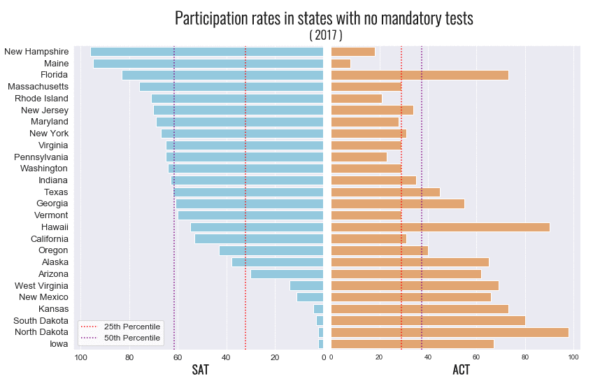
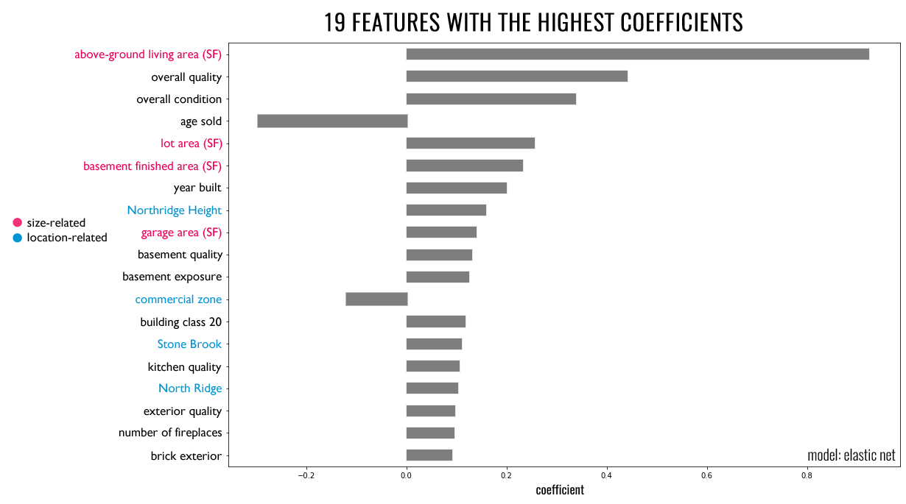
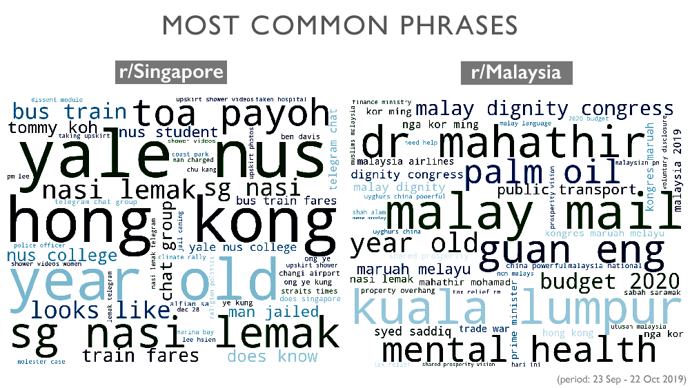
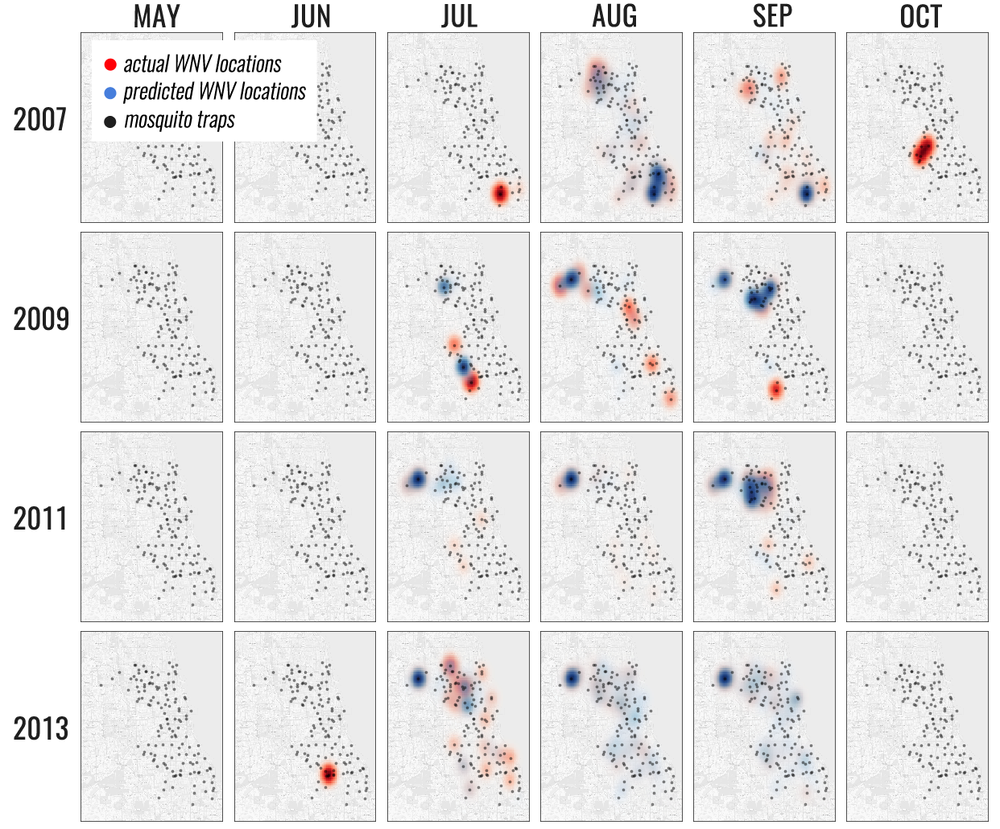
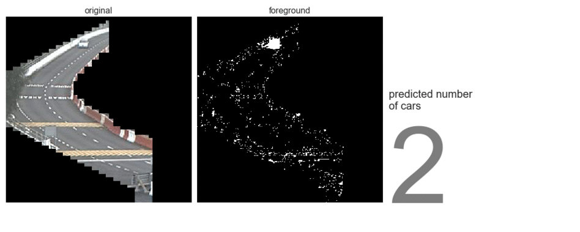

# Portfolio
---
Hello 👋 I'm Elaine and this is a summary of the things I have worked on. More specific technical details are in their respective githubs (links included). If you're interested to know more, feel free to [get in touch](mailto:elainezw92@gmail.com) (or check out my [résumé](./resume.pdf)/[LinkedIn](https://www.linkedin.com/in/elainezw/))! 

#### Contents
1. [Data Science](https://github.com/zzeniale/portfolio#data-science)
2. [Workflow Optimisations](https://github.com/zzeniale/portfolio#workflow-optimisations)
3. [Side Projects](https://github.com/zzeniale/portfolio#side-projects)

---
## Data Science

### 1. SAT and ACT scores analysis
Oct 2019 | https://github.com/zzeniale/SAT-and-ACT-scores-analysis

##### Problem Statement
In this project I examined trends in SAT and ACT participation rates as well as aggregate scores from 2017 and 2018. Participation rates vary greatly by state, and the aim of this project was to uncover underlying patterns in order to suggest a suitable state in which to improve SAT participation rates.

##### Summary of Findings
High participation rates for one test usually means low participation rates in the other, a trend that is especially true for states where one of the tests is mandatory. As such, efforts to increase participation rates for the SAT should be diverted away from states currently with mandatory ACT testings, as they may not be as effective in these states.

Test scores remained largely similar between 2017 and 2018, as did the states that scored the highest/lowest. In states that made one test mandatory for all students, test scores also tend to be lower for that test, compared to results from states where the test is voluntary.

Based on data examined, efforts to increase SAT participation rates should be focused on California, where neither the SAT or ACT is currently mandatory at the moment. As of 2018, its SAT participation rates remained below the 50th percentile compared to other states. Being the most populous state in the US with high population densities, focusing on California would allow for greater efficiency in the distribution of manpower and efforts. Possible measures that can be implemented include making practice resources more readily available, and reducing the cost of taking the SAT.

##### The Process
- data cleaning
- exploratory data analysis of trends in scores and participation rates
- make and justify recommendations
- presentation of findings

##### Language
Python

##### Key Libraries
`pandas`, `NumPy`, `matplotlib`, `seaborn`

 

### 2. Ames Housing Price Prediction
Oct 2019 | https://github.com/zzeniale/Ames-housing-price-prediction

  

##### Problem Statement
I examined a comprehensive housing dataset from the city of Ames in Iowa, USA ([source](https://www.kaggle.com/c/dsi-us-6-project-2-regression-challenge/overview)). Homeowners looking to increase the value of their homes often spend too much on remodeling and don't get the return on investment when selling the house. On the other hand, people looking to buy houses want to get the best house possible given a budget. The goal of this project is to address some of these concerns, such as which features add the most value to a home, and what kind of house one would be able to afford with a certain budget. 

##### Summary of Findings
I tested four different regression models using a variety of feature engineering techniques. An elastic net regression model had the best predictive performance on housing sale price in Ames USA. The model revealed that square feet area, condition, age, and the location of the house are the most important determinants for how much a house sells for. With an R2 of 0.903, it can be used to predict house prices in Ames between 2006 to 2010 with relatively high accuracy based on characteristics of the house.

If one is looking to sell, they should do it sooner rather than later, as the age of the house is one the biggest contributing factor to the decrease in value. Having a garage in bad condition negatively affect value, and those looking to increase the value of their home could consider increasing the square footage of their house, renovating the kitchen and garage, and adding a fireplace.

The model may however have limited applicabilities, as it was developed using data on houses sold between 2006 - 2010 in Ames, USA. This dataset is limited in scope both in terms of the time frame captured, as well as location. In reality, house price may be difficult to predict as it is also affected by buyers' psychology, the economic climate, and other factors not included in the present dataset. There will never be a perfect model; the aim of this model is therefore not to give a perfect prediction, but act as a guideline to inform decisions.

##### The Process
- deal with missing data, outliers, and skewed distributions
- engineer new features such as age sold and whether the house had been remodelled
- model tuning and evaluations
- feature selection and identification of production model
- make and justify recommendations
- presentation of findings

##### Language
Python

##### Key Libraries 
`FeatureTools`, `scikit-learn`: `LinearRegression`, `Lasso`, `Ridge`, `ElasticNet`

 

### 3. Subreddit Classification
Oct 2019 | https://github.com/zzeniale/subreddit-classification

  

##### Problem Statement
In this project, I attempted to classify posts from two subreddits - [r/Singapore](https://www.reddit.com/r/singapore/) and [r/Malaysia](https://www.reddit.com/r/malaysia/). Despite their shared heritage and history (Singapore was part of Malaysia until her separation and independence on 9 August 1965[1](http://eresources.nlb.gov.sg/history/events/dc1efe7a-8159-40b2-9244-cdb078755013)), Singapore has taken on a very different development path since independence. The goal of this project is therefore to try and figure out how similar Singaporeans and Malaysians are today, by looking at what they talk about on their subreddits. 

##### Summary of Findings
I developed a word-frequency based classification model to predict the subreddit that a random post belongs to. A variety of preliminary models were tested and evaluated based on prediction accuracy, i.e. how many posts they were able to correctly classify. The final production model was a multinomial naive Bayes classifier that makes predictions based on title content and post lengths, with an accuracy of 71%. This shows that the posts in r/Malaysia and r/Singapore are fairly different, but still have a good amount of similarities. The differences may mainly be due to differences in current affairs in Singapore and Malaysia. It is therefore not surprising that the two subreddits are somewhat distinguishable from each other, as the current affair topics in different countries will undoubtedly be different. The similarities behind the model misclassifications may be due to more generic, day-to-day topics such as people asking for help or life advice, which are likely to be similar between the two countries.

To further improve model accuracy and ability to predict on future data, a bigger corpus that incorporates a bigger vocabulary on the current affairs in Singapore and Malaysia is needed. As news are constantly changing, new words are also constantly emerging in these subreddits. Therefore, it would not be enough to train the model on/obtain the training corpus from past subreddit posts. A more useful corpus for model training would be english new sites that report on both Singapore and Malaysia, such Channel News Asia.

##### The Process
- scrape data using the Reddit API
- clean text data: remove moderator posts, html links, etc
- engineer new features such as number of comments, length of title, length of post
- text tokenisation and normalisation
- feature selection using mutual information, chi2 statistic, and document frequency
- model tuning and evaluations
- identification of production model
- presentation of findings

##### Language
Python

##### Key Libraries
`requests`, `PRAW`, `regex`, `spacy`, `nltk`, `scikit-learn`: `CountVectorizer`, `TfidfVectorizer`, `Binarizer`, `SelectPercentile`, `mutual_info_classif`, `chi2`, `Pipeline`, `LogisticRegression`, `KNeighborsClassifier`, `MultinomialNB`

 

### 4. West Nile Virus Prediction in Chicago
Nov 2019 | https://github.com/zzeniale/West-Nile-Virus-prediction

  

##### Problem Statement
West Nile virus (WNV) is the leading mosquito-borne disease in the United States ([CDC, 2009](https://www.cdc.gov/westnile/index.html)). In view of the recent outbreak of WNV in Chicago, the Chicago Department of Public Health (CDPH) has set up a surveillance and control system to trap mosquitos and test for the presence of WNV. The goal of this project is to use these surveillance data ([source](https://www.kaggle.com/c/predict-west-nile-virus/)) to predict the occurrence of WNV, given time, location, and mosquito species. Findings from this project can help guide and inform decisions on where and when to deploy pesticides throughout the city, to maximise pesticide effectiveness and minimise spending.

##### Summary of Findings
Using XGBoost (our best performing model), we achieved an ROC AUC of 0.834. With this model, we found that WNV is more prevalent under certain conditions. Week of year was the top predictor by far for our model, followed by day of year, 18-days rolling sum of daylight hours, <i>Culex restuans</i>, and 18-days rolling mean of average temperature. This means that WNV is most likely to occur during certain weeks of the year, and therefore spray efforts should be concentrated during this period. 

After conducting a cost-benefit analysis, we found that the money saved from reducing WNV cases would at most fund about 300 - 500 sprays. However, examination of mosquito numbers and WNV occurences before and after spraying does not conclusively show an effect from spraying. Most of the spraying was conducted in September, but WNV peaks in August. Therefore, more evidence (from a better designed spraying regime) are needed for a more concrete recommendation. For example, spraying efforts could be concentrated at the beginning of August so that there would be enough time to observe if mosquito numbers decline, in the relative absence of other confounding factors (such as temperature). 

##### The Process
This was a group project, and my contributions were:
- examine and clean weather data and data from mosquito traps 
- engineer new features such as temperature x precipitation, delayed temperature and precipitation, etc
- tuning and evaluation of XGB classifier
- creating data visualisations
- presentation of findings

##### Language
Python

##### Key Libraries 
`imblearn`, `xgboost`

 

### 5. Traffic volume estimation from images
Nov 2019 | https://github.com/zzeniale/GA-Capstone-Project-Traffic-Volume-Prediction

  

##### Problem Statement
Estimation of traffic conditions is important in allowing commuters to decide on the best time and route of travel. This is an especially pertinent problem at the two causeways (Woodlands and Tuas) that bridge the strait between Singapore and Malaysia. On an average day, 350,000 travellers cross the Woodlands causeway alone[1](https://www.straitstimes.com/singapore/a-look-at-woodlands-checkpoint-singapores-first-and-last-line-of-defence), making it one of the busiest overland border crossings in the region[2](https://infographics.channelnewsasia.com/interactive/causewayjam/index.html). For Singaporeans, crossing into Malaysia can take anywhere from 30 minutes at optimal conditions and several hours during popular crossing times such as Saturday mornings. Having an understanding of existing traffic conditions at the checkpoints would allow Singaporean commuters to make better decisions about whether or not to make the journey across at a given time.

The goal of this project is to use deep learning and image processing techniques to extract real-time traffic volume from traffic camera images. This has the potential to complement existing solutions on the market to allow better representations of traffic situations. Due to time limitations, the scope of this project is currently limited to daytime traffic at the Tuas Checkpoint. 

##### Summary of Findings
The low resolution of the images hindered the training of an object detection model. As such, in this project I used a background subtraction algorithm (as shown in the figure above) followed by several machine learning and deep learning approaches to predict the number of cars in each image. The final production (XGBoost) model extracts the number of cars from traffic images with relatively high accuracy (test MAE = 6.59), thus providing a direct estimation of road congestion in contrast to the proxy-based model used by Google Maps, which bases their traffic information on a combination of real-time data sent by smartphones and historic travel times. However, what this model lacks is the ability to estimate travel times. The two approaches should therefore be considered complementary, and could be combined for a more well-rounded application that provides better recommendations to commuters.

Model deployment (still a work in progress) is covered in a different repository: https://github.com/zzeniale/traffic-app. Future expansions to include the Woodlands Checkpoint, nighttime traffic, as well as forecasting are possible.

##### The Process
- scrape images from the [traffic cameras API](https://data.gov.sg/dataset/traffic-images) on Data.gov.sg
- process images using `scikit-images` and `OpenCV`
- apply background subtraction using `OpenCV`
- manually label images
- test classification and regression machine learning and deep learning models
- deploy production model in Heroku with `Flask`

##### Language & Tools
Python, Heroku (Advanced Scheduler, Heroku Postgres)

##### Key Libraries 
`requests`, `OpenCV`, `scikit-image`, `keras`, `Flask`

 

---
## Workflow Optimisations

### 1. Windows Explorer Tools
Jan 2019 | https://github.com/zzeniale/Windows-Explorer-Tools

I made these to automate repetitive workflow tasks at work, such as copying and pasting from multiple directories, as we often had to manually sort through hundreds of photos from field surveys.
1. <i>CopyFilesFromFolders.py</i>: Copies and renames files from multiple folders. Useful for compiling multiple documents, such as photos placed into folders sorted by date. First prompts the user to select the parent folder.
2. <i>CreateFolders.py</i>: Creates a list of sequentially named folders with a custom suffix in a directory. First prompts the user to select the directory and input the custom suffix. Useful when a large number of folders need to be created, e.g. for organisation of photos.

##### Language
Python

##### Key Libraries
`os`, `tkinter`

 

### 2. Microsoft Word Tools
Feb 2019 | https://github.com/zzeniale/MS-Word-Tools

These are two of the scripts I made to automate some repetitive and error-prone steps in report preparation (so that I can focus more time on actually writing the report):
1. <i>Word_ColourCells.py</i>: Prompts the user to select a directory, and insert all photos from directory into a table in a word document. Useful for inserting large amounts of photos or graphics.
2. <i>Word_InsertPhotos.py</i>: Colours cells in a table differently according to the values in them. First prompts the user to select a document that contains a table of values. Useful for creating visual representations of metrics (e.g. red for negative numbers, blue for zeros, green for positive numbers).

##### Language
Python

##### Key Libraries
`docx`, `os`, `tkinter`

 

### 3. Webscraper for Digital Globe
Jun 2019 | https://github.com/zzeniale/Webscraper-for-Digital-Globe

A simple webscraper for Digital Globe - checks for new satellite images over Singapore from the current date to two weeks prior. Useful for remote-sensing purposes. 

##### Language
Python

##### Key Libraries
`Selenium`

 

---
## Side Projects

### Photography
https://elainezphotography.wordpress.com/

  

Photography has been a long-time passion of mine because of how impactful photos (and indeed, visuals) can be - they are often the easiest way to convey a message, be it the moodiness of a foggy winter evening or the spread of disease at a location.

I have been taking photos for over ten years now. My main interests are wildlife, landscape, and travel photography. Nowadays I shoot mostly when I travel. Some of my favourite projects are:
- [The Dalmatian Coast (2019)](https://elainezphotography.wordpress.com/2019/11/08/2019-august-dalmatia-croatia/)
- [Seabirds of Farne (2015)](https://elainezphotography.wordpress.com/2015/07/26/2015-jun-farne-islands-uk/)
- [Scottish Highlands and Islands (2013)](https://elainezphotography.wordpress.com/2013/10/23/2013-sep-scotland-uk/)

##### Tools
- DSLR
- Adobe Photoshop
- Adobe Lightroom